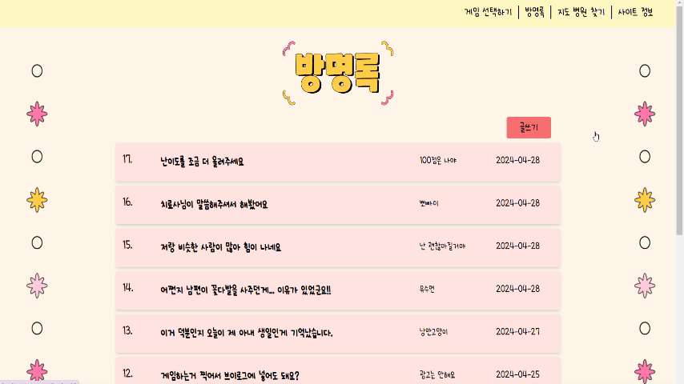
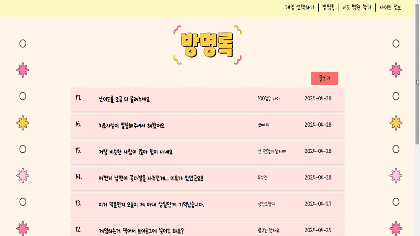
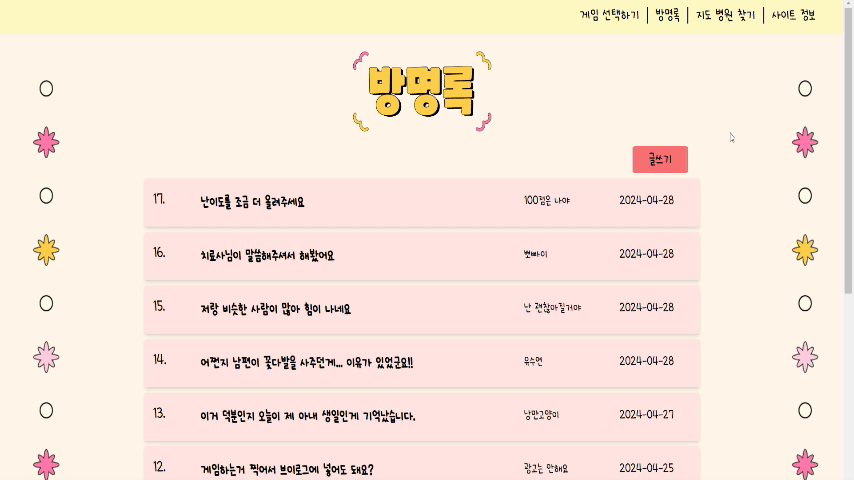

# For Everyone

## 📋목차
1. [기획의도 및 기대효과](#기획의도-및-기대효과)
2. [서비스 기능](#서비스-기능)
3. [사용한 기술스택](#사용한-기술스택)
4. [API 설계](API-설계)
5. [프로젝트 구조](#프로젝트-구조)

### 🎁기획의도 및 기대효과


### 🎈서비스 기능

#### 메인 화면

```
로고를 클릭하면 본 게임사이트로 접속이 됩니다.
```
#### 게임 선택 화면

```
- 두 게임중 하나를 골라 클릭합니다.
- 사이트 정보 버튼과 병원 지도찾기 화면으로 이동할 수 있는 버튼이 있습니다.
```
#### 게임 난이도 선택 화면


```
1,2, 3 단계 중 하나를 선택합니다.
```

#### 게임 설명 화면

 |
---|---|
```
게임을 시작하기 전 설명이 나옵니다.
```
#### 게임 화면

#### 점수 화면

#### 방명록 목록

```
글 목록을 볼 수 있으며 이전,다음 페이지나 숫자를 클릭하면 해당 페이지로 이동합니다.
```
#### 상세 방명록 글 읽기

```
제목을 누르면 해당 글을 볼 수 있습니다.
```
#### 방명록 글쓰기 화면

```
글쓰기를 누르면 자유롭게 방명록에 글을 남길 수 있습니다.
```
#### 병원 지도 검색 화면


```
'지역 + 병원'을 검색하면 마커가 표시되어 결과가 나오고 결과 목록에 마우스를 올리면 지도화면에서 해당 병원의 위치에 이름이 나타납니다.
```
#### 사이트 정보 화면


### 프로젝트 기간 : 
### 사용한 기술스택

### ERD

### API설계


### 💻프로젝트 구조

```
📦src
 ┣ 📂api
 ┃ ┣ 📜cardApi.js
 ┃ ┣ 📜guestBookApi.js
 ┃ ┗ 📜memberApi.js
 ┣ 📂components
 ┃ ┣ 📂Button
 ┃ ┃ ┣ 📜Logo.js
 ┃ ┃ ┣ 📜SelectMenu.js
 ┃ ┃ ┣ 📜StartButton.css
 ┃ ┃ ┣ 📜StartButton.js
 ┃ ┃ ┗ 📜StopMenu.js
 ┃ ┣ 📂CardGame
 ┃ ┃ ┣ 📜GameCard.css
 ┃ ┃ ┣ 📜GameCard.js
 ┃ ┃ ┣ 📜GuessCard.css
 ┃ ┃ ┗ 📜GuessCard.js
 ┃ ┣ 📂GameElements
 ┃ ┃ ┣ 📜HowTo.css
 ┃ ┃ ┣ 📜HowTo.js
 ┃ ┃ ┣ 📜Score.css
 ┃ ┃ ┣ 📜Score.js
 ┃ ┃ ┣ 📜SetUp.css
 ┃ ┃ ┗ 📜SetUp.js
 ┃ ┣ 📂GuestBook
 ┃ ┃ ┣ 📜Add.js
 ┃ ┃ ┣ 📜Index.js
 ┃ ┃ ┣ 📜List.js
 ┃ ┃ ┣ 📜Modify.js
 ┃ ┃ ┗ 📜Read.js
 ┃ ┣ 📂Map
 ┃ ┃ ┣ 📜MapSearch.css
 ┃ ┃ ┗ 📜MapSearch.js
 ┃ ┗ 📂NumberGame
 ┃ ┃ ┣ 📜GameNumber.css
 ┃ ┃ ┣ 📜GameNumber.js
 ┃ ┃ ┣ 📜ReverseNumber.css
 ┃ ┃ ┗ 📜ReverseNumber.js
 ┣ 📂hooks
 ┃ ┗ 📜useCustomMove.js
 ┣ 📂images
 ┃ ┣ 📜back_check.png
 ┃ ┣ 📜back_circle.png
 ┃ ┣ 📜back_ivory.png
 ┃ ┣ 📜logo.png
 ┃ ┣ 📜setup_background_full.png
 ┃ ┣ 📜번호외우기.png
 ┃ ┗ 📜짝맞추기.png
 ┣ 📂layouts
 ┃ ┗ 📜BasicLayout.js
 ┣ 📂pages
 ┃ ┣ 📂guestbook
 ┃ ┃ ┣ 📜AddPage.js
 ┃ ┃ ┣ 📜IndexPage.js
 ┃ ┃ ┣ 📜ListPage.js
 ┃ ┃ ┣ 📜ModifyPage.js
 ┃ ┃ ┗ 📜ReadPage.js
 ┃ ┣ 📜AboutPage.js
 ┃ ┣ 📜CardPage.js
 ┃ ┣ 📜GameNumber.css
 ┃ ┣ 📜GameNumber1.js
 ┃ ┣ 📜GuestBookPage.js
 ┃ ┣ 📜IndexPage.js
 ┃ ┣ 📜MainPage.js
 ┃ ┣ 📜MapPage.css
 ┃ ┣ 📜MapPage.js
 ┃ ┣ 📜NumberPage.js
 ┃ ┣ 📜Select.css
 ┃ ┣ 📜Select.js
 ┃ ┗ 📜SignUpPage.js
 ┣ 📂router
 ┃ ┣ 📜guestbookRouter.js
 ┃ ┗ 📜root.js
 ┣ 📂slices
 ┃ ┗ 📜loginSlice.js
 ┣ 📂styles
 ┃ ┗ 📜fonts.css
 ┣ 📜App.css
 ┣ 📜App.js
 ┣ 📜App.test.js
 ┣ 📜index.css
 ┣ 📜index.js
 ┣ 📜logo.svg
 ┣ 📜reportWebVitals.js
 ┣ 📜setupTests.js
 ┗ 📜store.js
```

```
📦src
 ┣ 📂main
 ┃ ┣ 📂java
 ┃ ┃ ┗ 📂org
 ┃ ┃ ┃ ┗ 📂zerock
 ┃ ┃ ┃ ┃ ┗ 📂bgapi
 ┃ ┃ ┃ ┃ ┃ ┣ 📂config
 ┃ ┃ ┃ ┃ ┃ ┃ ┣ 📜CardServletConfig.java
 ┃ ┃ ┃ ┃ ┃ ┃ ┣ 📜CorsConfig.java
 ┃ ┃ ┃ ┃ ┃ ┃ ┣ 📜CustomSecurityConfig.java
 ┃ ┃ ┃ ┃ ┃ ┃ ┣ 📜CustomServletConfig.java
 ┃ ┃ ┃ ┃ ┃ ┃ ┣ 📜GuestbookServletConfig.java
 ┃ ┃ ┃ ┃ ┃ ┃ ┣ 📜RootConfig.java
 ┃ ┃ ┃ ┃ ┃ ┃ ┣ 📜SecurityConfig.java
 ┃ ┃ ┃ ┃ ┃ ┃ ┗ 📜WebConfig.java
 ┃ ┃ ┃ ┃ ┃ ┣ 📂controller
 ┃ ┃ ┃ ┃ ┃ ┃ ┣ 📂advice
 ┃ ┃ ┃ ┃ ┃ ┃ ┃ ┗ 📜BasicControllerAdvice.java
 ┃ ┃ ┃ ┃ ┃ ┃ ┣ 📂formatter
 ┃ ┃ ┃ ┃ ┃ ┃ ┃ ┗ 📜LocalDateFormatter.java
 ┃ ┃ ┃ ┃ ┃ ┃ ┣ 📜BasicController.java
 ┃ ┃ ┃ ┃ ┃ ┃ ┣ 📜CardController.java
 ┃ ┃ ┃ ┃ ┃ ┃ ┣ 📜GuestBookController.java
 ┃ ┃ ┃ ┃ ┃ ┃ ┗ 📜SignupController.java
 ┃ ┃ ┃ ┃ ┃ ┣ 📂domain
 ┃ ┃ ┃ ┃ ┃ ┃ ┣ 📜GuestBook.java
 ┃ ┃ ┃ ┃ ┃ ┃ ┣ 📜Member.java
 ┃ ┃ ┃ ┃ ┃ ┃ ┗ 📜MemberRole.java
 ┃ ┃ ┃ ┃ ┃ ┣ 📂dto
 ┃ ┃ ┃ ┃ ┃ ┃ ┣ 📜CardDTO.java
 ┃ ┃ ┃ ┃ ┃ ┃ ┣ 📜GuestBookDTO.java
 ┃ ┃ ┃ ┃ ┃ ┃ ┣ 📜MemberDTO.java
 ┃ ┃ ┃ ┃ ┃ ┃ ┣ 📜PageRequestDTO.java
 ┃ ┃ ┃ ┃ ┃ ┃ ┗ 📜PageResponseDTO.java
 ┃ ┃ ┃ ┃ ┃ ┣ 📂repository
 ┃ ┃ ┃ ┃ ┃ ┃ ┣ 📜GuestBookRepository.java
 ┃ ┃ ┃ ┃ ┃ ┃ ┗ 📜MemberRepository.java
 ┃ ┃ ┃ ┃ ┃ ┣ 📂security
 ┃ ┃ ┃ ┃ ┃ ┃ ┣ 📂filter
 ┃ ┃ ┃ ┃ ┃ ┃ ┃ ┗ 📜JWTCheckFilter.java
 ┃ ┃ ┃ ┃ ┃ ┃ ┣ 📂handler
 ┃ ┃ ┃ ┃ ┃ ┃ ┃ ┣ 📜APILoginFail.java
 ┃ ┃ ┃ ┃ ┃ ┃ ┃ ┗ 📜APILoginSuccess.java
 ┃ ┃ ┃ ┃ ┃ ┃ ┗ 📜CustomUserDetailsService.java
 ┃ ┃ ┃ ┃ ┃ ┣ 📂service
 ┃ ┃ ┃ ┃ ┃ ┃ ┣ 📜GuestBookService.java
 ┃ ┃ ┃ ┃ ┃ ┃ ┗ 📜GuestBookServiceImp.java
 ┃ ┃ ┃ ┃ ┃ ┣ 📂util
 ┃ ┃ ┃ ┃ ┃ ┃ ┣ 📜CardFileUtil.java
 ┃ ┃ ┃ ┃ ┃ ┃ ┣ 📜JWT.java
 ┃ ┃ ┃ ┃ ┃ ┃ ┗ 📜JWTException.java
 ┃ ┃ ┃ ┃ ┃ ┗ 📜BgapiApplication.java
 ┃ ┗ 📂resources
 ┃ ┃ ┣ 📂META-INF
 ┃ ┃ ┃ ┗ 📜additional-spring-configuration-metadata.json
 ┃ ┃ ┣ 📂static
 ┃ ┃ ┃ ┗ 📜index.html
 ┃ ┃ ┣ 📂templates
 ┃ ┃ ┃ ┗ 📜home.html
 ┃ ┃ ┗ 📜application.properties
 ┗ 📂test
 ┃ ┗ 📂java
 ┃ ┃ ┗ 📂org
 ┃ ┃ ┃ ┗ 📂zerock
 ┃ ┃ ┃ ┃ ┗ 📂bgapi
 ┃ ┃ ┃ ┃ ┃ ┣ 📂repository
 ┃ ┃ ┃ ┃ ┃ ┃ ┣ 📜GuestBookRepositoryTests.java
 ┃ ┃ ┃ ┃ ┃ ┃ ┗ 📜MemberRepositoryTests.java
 ┃ ┃ ┃ ┃ ┃ ┣ 📂service
 ┃ ┃ ┃ ┃ ┃ ┃ ┗ 📜GuestBookServiceTests.java
 ┃ ┃ ┃ ┃ ┃ ┗ 📜BgapiApplicationTests.java
```
