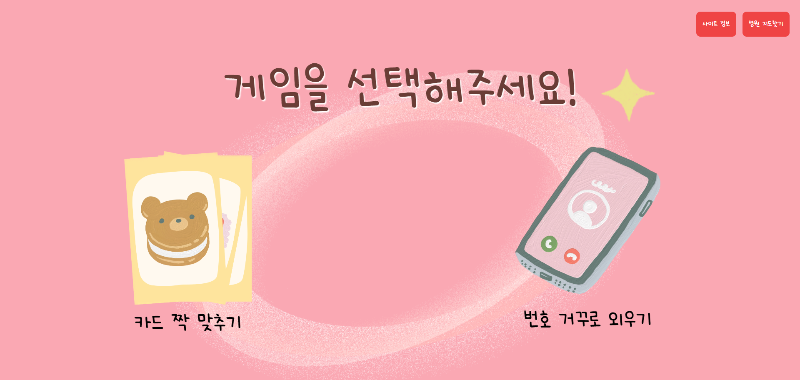
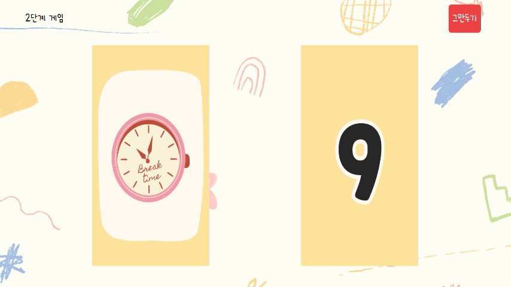
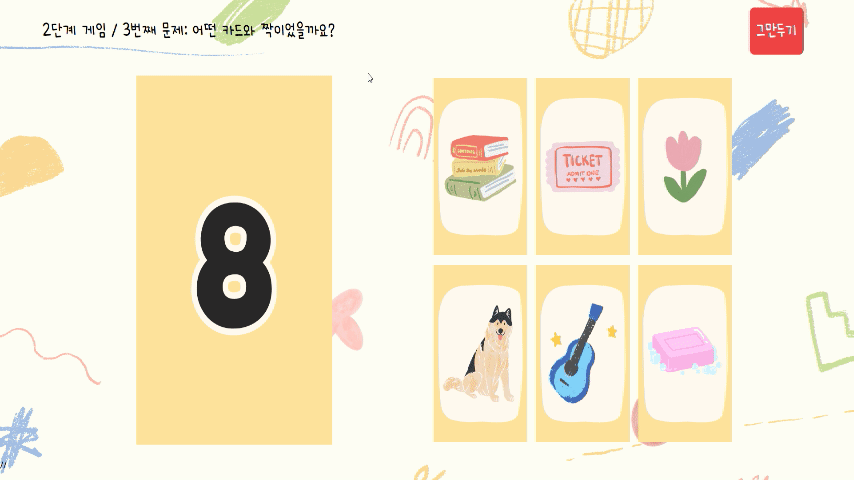
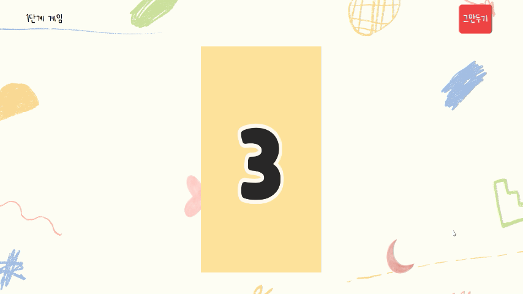
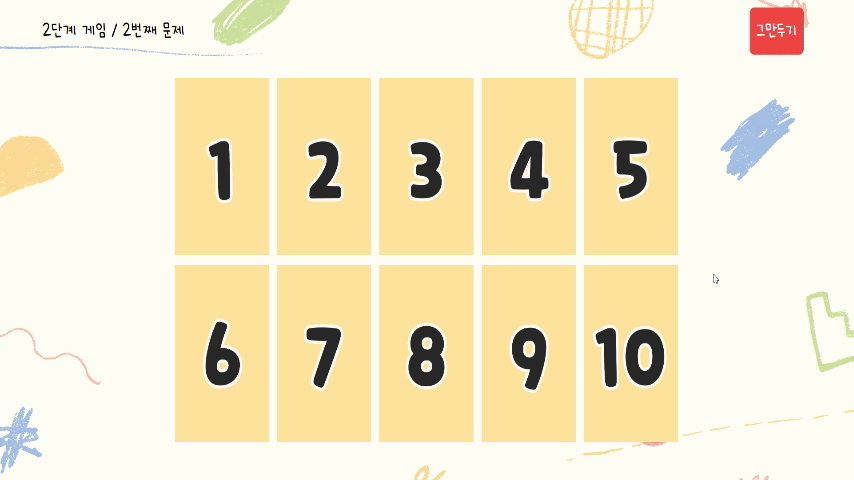
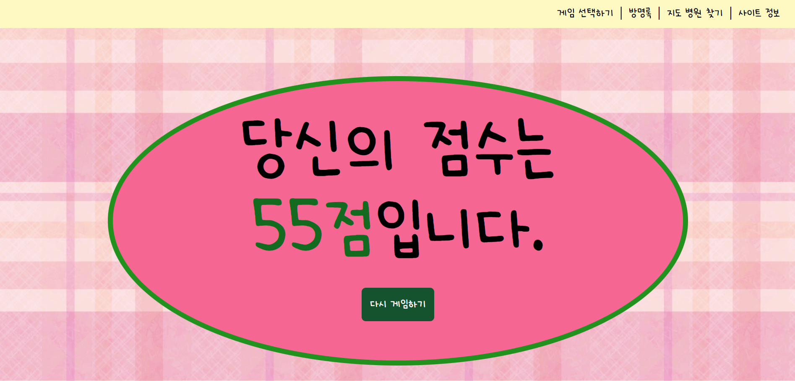
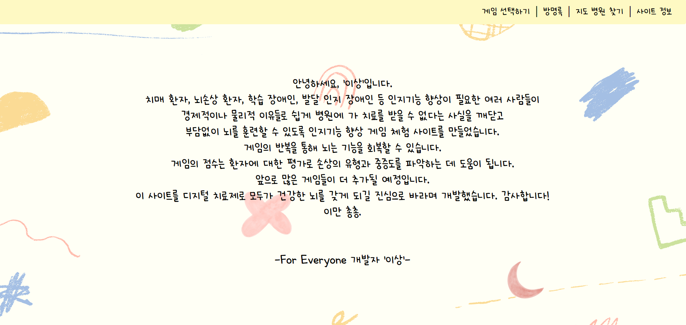

# For Everyone

## 📋목차
1. [기획의도 및 기대효과](#기획의도-및-기대효과)
2. [서비스 기능](#서비스-기능)
3. [사용한 기술스택](#사용한-기술스택)
4. [프로젝트 구조](#프로젝트-구조)

### 🎁 기획의도 및 기대효과
<br/>
 대한민국은 치매 환자 추정수가 100만명을 넘었으며 치매 전 단계인 경도인지장애 환자도 34만명이 넘는다. 이는 인간의 존엄성과 밀접한 관련이 있어 그 무엇보다 두려운 질병이다. 특히 돌보는 사람에게 피해를 준다는 인식이 있기에 본인들도 빨리 치료하고자 한다. 인지기능을 관리하는 것이 필요하나 실제 병원에서 받는 치료는 비용이 높아 주기적으로 받기 어려우며 거동이 불편한 경우 찾아가 치료를 받는 것에 무리가 있다.
<br/>
 이를 위해 인지 기능 향상을 위한 '디지털 치료제'를 만들었다. 뇌 기능이 계속 유지되도록 자극하는 훈련을 게임으로 구현했으며 게임 이후 병원을 가야겠다는 생각이 든다면 사용할 수 있는 병원 지도 검색을 추가하였다. 혼자라는 좌절감에 빠지지 않도록 다른 사람들의 발자국을 확인할 수 있는 방명록 페이지도 만들었다. 쉬운 진행을 위해 누구든지 알아보기 쉽도록 큰 글씨로 설정하였고 단순하게 디자인하였다. 기존 인지치료와 달리 사용자 스스로 반복할 수 있고 시간, 공간, 인력 가용성 등 물리적 한계와 비용적 문제를 극복할 수 있다. 치매 환자 뿐만 아니라  뇌손상 환자, 학습 장애, 발달 인지 장애 아동 등도 사용하기 편하게 만들었다. 인지기능 향상은 우울 감소, 생활 만족도 상승 등 정서에도 좋은 영향을 주고 학습능력 증진, 생활 능력 향상으로 이어지기 때문에 나아가 사회 활동 참여 기회도 확대될 것으로 예상된다. 
 <br/>
 
### 🎈 서비스 기능

#### 메인 화면

```
로고를 클릭하면 본 게임사이트로 접속이 됩니다.
```
#### 게임 선택 화면

```
- 두 게임중 하나를 골라 클릭합니다.
- 사이트 정보 버튼과 병원 지도찾기 화면으로 이동할 수 있는 버튼이 있습니다.
```
#### 게임 난이도 선택 화면


```
1,2, 3 단계 중 하나를 선택합니다.
```

#### 게임 설명 화면

 |
---|---|
```
게임을 시작하기 전 설명이 나옵니다.
```
#### 게임 화면

|
---|---|
```
그림과 숫자가 짝을 지어 나옵니다. 이후 순서가 섞여 그림과 숫자 중 랜덤으로 보기카드가 나오면 선택지에서 짝을 고르면 됩니다.
```

|
---|---|
```
숫자카드가 나옵니다. 이후 숫자카드가 나온 순서를 거꾸로 선택하면 됩니다.
```
#### 점수 화면

```
게임 점수가 나오며 게임 다시하기를 누르면 게임 선택화면으로 이동합니다.
```
#### 방명록 목록

```
글 목록을 볼 수 있으며 이전,다음 페이지나 숫자를 클릭하면 해당 페이지로 이동합니다.
```
#### 상세 방명록 글 읽기

```
제목을 누르면 해당 글을 볼 수 있습니다.
```
#### 방명록 글쓰기 화면

```
글쓰기를 누르면 자유롭게 방명록에 글을 남길 수 있습니다.
```
#### 병원 지도 검색 화면


```
'지역 + 병원'을 검색하면 마커가 표시되어 결과가 나오고 결과 목록에 마우스를 올리면 지도화면에서 해당 병원의 위치에 이름이 나타납니다.
```
#### 사이트 정보 화면

```
사이트를 만든 이유와 효과가 적혀져 있습니다.
```
### 🛠 사용한 기술스택
| 언어 | JavaScript, HTML, CSS, JAVA |
| --- | --- |
| 플랫폼 | FE: React , BE: Spring Boot |
| DB | mariaDB |


### 💻프로젝트 구조
#### ▪ 프론트엔드
```
📦src
 ┣ 📂api
 ┃ ┣ 📜cardApi.js
 ┃ ┣ 📜guestBookApi.js
 ┃ ┗ 📜memberApi.js
 ┣ 📂components
 ┃ ┣ 📂button
 ┃ ┃ ┣ 📜Logo.js
 ┃ ┃ ┣ 📜SelectMenu.js
 ┃ ┃ ┣ 📜StartButton.css
 ┃ ┃ ┣ 📜StartButton.js
 ┃ ┃ ┗ 📜StopMenu.js
 ┃ ┣ 📂cardGame
 ┃ ┃ ┣ 📜GameCard.css
 ┃ ┃ ┣ 📜GameCard.js
 ┃ ┃ ┣ 📜GuessCard.css
 ┃ ┃ ┗ 📜GuessCard.js
 ┃ ┣ 📂common
 ┃ ┃ ┣ 📜MenuBar.css
 ┃ ┃ ┣ 📜MenuBar.js
 ┃ ┃ ┣ 📜Modal.css
 ┃ ┃ ┗ 📜Modal.js
 ┃ ┣ 📂gameElements
 ┃ ┃ ┣ 📜HowTo.css
 ┃ ┃ ┣ 📜HowTo.js
 ┃ ┃ ┣ 📜Score.css
 ┃ ┃ ┣ 📜Score.js
 ┃ ┃ ┣ 📜SetUp.css
 ┃ ┃ ┗ 📜SetUp.js
 ┃ ┣ 📂guestbook
 ┃ ┃ ┣ 📜Add.css
 ┃ ┃ ┣ 📜Add.js
 ┃ ┃ ┣ 📜List.css
 ┃ ┃ ┣ 📜List.js
 ┃ ┃ ┣ 📜Modify.js
 ┃ ┃ ┣ 📜Page.css
 ┃ ┃ ┣ 📜Page.js
 ┃ ┃ ┣ 📜Read.css
 ┃ ┃ ┗ 📜Read.js
 ┃ ┣ 📂map
 ┃ ┃ ┣ 📜MapSearch.css
 ┃ ┃ ┗ 📜MapSearch.js
 ┃ ┗ 📂numberGame
 ┃ ┃ ┣ 📜GameNumber.css
 ┃ ┃ ┣ 📜GameNumber.js
 ┃ ┃ ┣ 📜ReverseNumber.css
 ┃ ┃ ┗ 📜ReverseNumber.js
 ┣ 📂hooks
 ┃ ┗ 📜useCustomMove.js
 ┣ 📂images
 ┃ ┣ 📜back_check.png
 ┃ ┣ 📜back_circle.png
 ┃ ┣ 📜back_gb.png
 ┃ ┣ 📜back_gb_!.png
 ┃ ┣ 📜back_ivory.png
 ┃ ┣ 📜g_logo.png
 ┃ ┣ 📜logo.png
 ┃ ┣ 📜setup_background_full.png
 ┃ ┣ 📜bearCard.png
 ┃ ┗ 📜phoneCard.png
 ┣ 📂layouts
 ┃ ┗ 📜BasicLayout.js
 ┣ 📂pages
 ┃ ┣ 📂guestbook
 ┃ ┃ ┣ 📜AddPage.js
 ┃ ┃ ┣ 📜IndexPage.js
 ┃ ┃ ┣ 📜ListPage.css
 ┃ ┃ ┣ 📜ListPage.js
 ┃ ┃ ┣ 📜ModifyPage.js
 ┃ ┃ ┣ 📜ReadPage.css
 ┃ ┃ ┗ 📜ReadPage.js
 ┃ ┣ 📜AboutPage.js
 ┃ ┣ 📜CardPage.js
 ┃ ┣ 📜GameNumber.css
 ┃ ┣ 📜IndexPage.js
 ┃ ┣ 📜MainPage.js
 ┃ ┣ 📜MapPage.css
 ┃ ┣ 📜MapPage.js
 ┃ ┣ 📜NumberPage.js
 ┃ ┣ 📜Select.css
 ┃ ┣ 📜Select.js
 ┃ ┗ 📜SignUpPage.js
 ┣ 📂router
 ┃ ┣ 📜guestbookRouter.js
 ┃ ┗ 📜root.js
 ┣ 📂slices
 ┃ ┗ 📜loginSlice.js
 ┣ 📂styles
 ┃ ┗ 📜fonts.css
 ┣ 📜App.css
 ┣ 📜App.js
 ┣ 📜App.test.js
 ┣ 📜index.css
 ┣ 📜index.js
 ┣ 📜logo.svg
 ┣ 📜reportWebVitals.js
 ┣ 📜setupTests.js
 ┗ 📜store.js
```
#### ▪ 백엔드
```
📦src
 ┣ 📂main
 ┃ ┣ 📂java
 ┃ ┃ ┗ 📂org
 ┃ ┃ ┃ ┗ 📂zerock
 ┃ ┃ ┃ ┃ ┗ 📂bgapi
 ┃ ┃ ┃ ┃ ┃ ┣ 📂config
 ┃ ┃ ┃ ┃ ┃ ┃ ┣ 📜CardServletConfig.java
 ┃ ┃ ┃ ┃ ┃ ┃ ┣ 📜CorsConfig.java
 ┃ ┃ ┃ ┃ ┃ ┃ ┣ 📜CustomSecurityConfig.java
 ┃ ┃ ┃ ┃ ┃ ┃ ┣ 📜CustomServletConfig.java
 ┃ ┃ ┃ ┃ ┃ ┃ ┣ 📜GuestbookServletConfig.java
 ┃ ┃ ┃ ┃ ┃ ┃ ┣ 📜RootConfig.java
 ┃ ┃ ┃ ┃ ┃ ┃ ┣ 📜SecurityConfig.java
 ┃ ┃ ┃ ┃ ┃ ┃ ┗ 📜WebConfig.java
 ┃ ┃ ┃ ┃ ┃ ┣ 📂controller
 ┃ ┃ ┃ ┃ ┃ ┃ ┣ 📂advice
 ┃ ┃ ┃ ┃ ┃ ┃ ┃ ┗ 📜BasicControllerAdvice.java
 ┃ ┃ ┃ ┃ ┃ ┃ ┣ 📂formatter
 ┃ ┃ ┃ ┃ ┃ ┃ ┃ ┗ 📜LocalDateFormatter.java
 ┃ ┃ ┃ ┃ ┃ ┃ ┣ 📜BasicController.java
 ┃ ┃ ┃ ┃ ┃ ┃ ┣ 📜CardController.java
 ┃ ┃ ┃ ┃ ┃ ┃ ┣ 📜GuestBookController.java
 ┃ ┃ ┃ ┃ ┃ ┃ ┗ 📜SignupController.java
 ┃ ┃ ┃ ┃ ┃ ┣ 📂domain
 ┃ ┃ ┃ ┃ ┃ ┃ ┣ 📜GuestBook.java
 ┃ ┃ ┃ ┃ ┃ ┃ ┣ 📜Member.java
 ┃ ┃ ┃ ┃ ┃ ┃ ┗ 📜MemberRole.java
 ┃ ┃ ┃ ┃ ┃ ┣ 📂dto
 ┃ ┃ ┃ ┃ ┃ ┃ ┣ 📜CardDTO.java
 ┃ ┃ ┃ ┃ ┃ ┃ ┣ 📜GuestBookDTO.java
 ┃ ┃ ┃ ┃ ┃ ┃ ┣ 📜MemberDTO.java
 ┃ ┃ ┃ ┃ ┃ ┃ ┣ 📜PageRequestDTO.java
 ┃ ┃ ┃ ┃ ┃ ┃ ┗ 📜PageResponseDTO.java
 ┃ ┃ ┃ ┃ ┃ ┣ 📂repository
 ┃ ┃ ┃ ┃ ┃ ┃ ┣ 📜GuestBookRepository.java
 ┃ ┃ ┃ ┃ ┃ ┃ ┗ 📜MemberRepository.java
 ┃ ┃ ┃ ┃ ┃ ┣ 📂security
 ┃ ┃ ┃ ┃ ┃ ┃ ┣ 📂filter
 ┃ ┃ ┃ ┃ ┃ ┃ ┃ ┗ 📜JWTCheckFilter.java
 ┃ ┃ ┃ ┃ ┃ ┃ ┣ 📂handler
 ┃ ┃ ┃ ┃ ┃ ┃ ┃ ┣ 📜APILoginFail.java
 ┃ ┃ ┃ ┃ ┃ ┃ ┃ ┗ 📜APILoginSuccess.java
 ┃ ┃ ┃ ┃ ┃ ┃ ┗ 📜CustomUserDetailsService.java
 ┃ ┃ ┃ ┃ ┃ ┣ 📂service
 ┃ ┃ ┃ ┃ ┃ ┃ ┣ 📜GuestBookService.java
 ┃ ┃ ┃ ┃ ┃ ┃ ┗ 📜GuestBookServiceImp.java
 ┃ ┃ ┃ ┃ ┃ ┣ 📂util
 ┃ ┃ ┃ ┃ ┃ ┃ ┣ 📜CardFileUtil.java
 ┃ ┃ ┃ ┃ ┃ ┃ ┣ 📜JWT.java
 ┃ ┃ ┃ ┃ ┃ ┃ ┗ 📜JWTException.java
 ┃ ┃ ┃ ┃ ┃ ┗ 📜BgapiApplication.java
 ┃ ┗ 📂resources
 ┃ ┃ ┣ 📂META-INF
 ┃ ┃ ┃ ┗ 📜additional-spring-configuration-metadata.json
 ┃ ┃ ┣ 📂static
 ┃ ┃ ┃ ┗ 📜index.html
 ┃ ┃ ┣ 📂templates
 ┃ ┃ ┃ ┗ 📜home.html
 ┃ ┃ ┗ 📜application.properties
 ┗ 📂test
 ┃ ┗ 📂java
 ┃ ┃ ┗ 📂org
 ┃ ┃ ┃ ┗ 📂zerock
 ┃ ┃ ┃ ┃ ┗ 📂bgapi
 ┃ ┃ ┃ ┃ ┃ ┣ 📂repository
 ┃ ┃ ┃ ┃ ┃ ┃ ┣ 📜GuestBookRepositoryTests.java
 ┃ ┃ ┃ ┃ ┃ ┃ ┗ 📜MemberRepositoryTests.java
 ┃ ┃ ┃ ┃ ┃ ┣ 📂service
 ┃ ┃ ┃ ┃ ┃ ┃ ┗ 📜GuestBookServiceTests.java
 ┃ ┃ ┃ ┃ ┃ ┗ 📜BgapiApplicationTests.java
```
